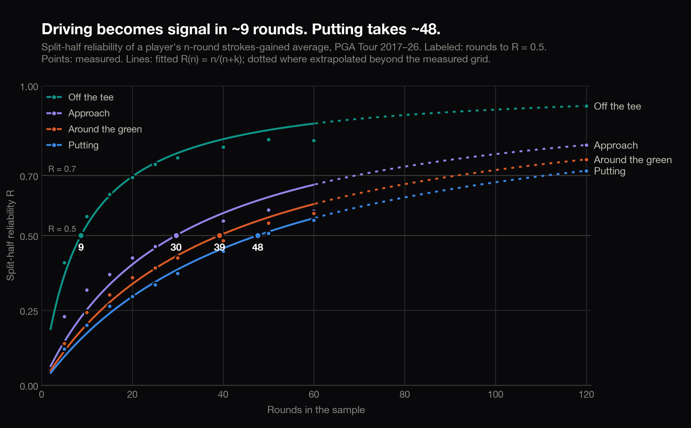

# How many rounds until you can trust a strokes-gained number?

Reliability and stabilization analysis of the 4 strokes-gained categories
(off the tee, approach, around the green, putting) using round-level PGA
Tour data from the DataGolf API: 131,847 rounds by 1,772 players,
2017 to mid-2026.

**[Read the full write-up →](https://sg-reliability.vercel.app)**



## Findings

- **Driving is trustworthy after roughly 9 rounds** (95% CI 8 to 10). It is
  the most reliable category by a wide margin, the most persistent year
  over year (r = 0.72), and the best single predictor of a player's future
  total strokes gained.
- **Putting takes roughly 48 rounds to become half signal** (CI 42 to 54)
  and about 111 to be mostly signal, more than a full season of tracked
  rounds. A 12-round putting hot streak deserves about 20% weight; the
  other 80% is better read as noise. The write-up walks through Jordan
  Spieth's 2019 putting run as a real example.
- **The ordering (OTT fastest, then approach, around the green, putting)
  holds under every check I ran**: split-half reliability, year-over-year
  correlation, and out-of-sample prediction of next-season total SG. Among
  established tour regulars the gaps shrink and almost everything except
  driving is noisy at small samples.

## How the analysis works

The full plan (questions, methods, thresholds, seeds, and what gets
reported regardless of outcome) was written and committed in
[`ANALYSIS_PLAN.md`](ANALYSIS_PLAN.md) before any result was computed.
In short: split-half reliability of n-round averages within two-year
windows, a Spearman-Brown fit R(n) = n/(n+k) per category, bootstrap
confidence intervals over players, plus model-free checks (year-over-year
correlation and next-season prediction). Data-quality decisions are
documented in [`writeup/data_quality.md`](writeup/data_quality.md), and
[`analysis/test_reliability.py`](analysis/test_reliability.py) validates
the pipeline against synthetic data with known reliability.

## Repo structure

```
├── data/            # cached API pulls — gitignored, never committed
├── scripts/         # fetch_data.py, run_analysis.py, make_figures.py, ...
├── analysis/        # reliability.py (methods), tests, results tables
├── figures/         # generated charts (SVG + PNG)
└── writeup/         # the article (markdown + self-contained HTML)
```

## Reproduce it

```bash
python3 -m venv .venv && source .venv/bin/activate
pip install -r requirements.txt
cp .env.example .env               # add your DataGolf API key
python scripts/fetch_data.py       # ~350 events, cached + resumable
python scripts/run_analysis.py     # the 4 pre-registered questions
python scripts/hot_streak_example.py
python scripts/make_figures.py
python scripts/build_writeup.py
python -m pytest analysis/         # test suite
```

Every number and figure in the write-up regenerates from these scripts
(fixed seed 42). Raw data comes from the
[DataGolf API](https://datagolf.com/api-access) and is cached locally but
never committed, per their redistribution terms.
