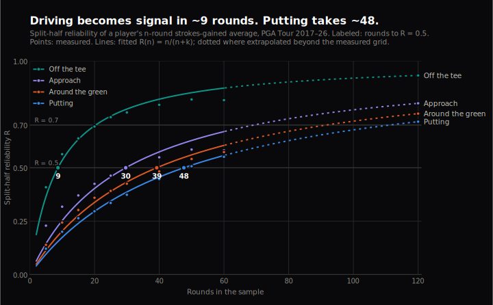
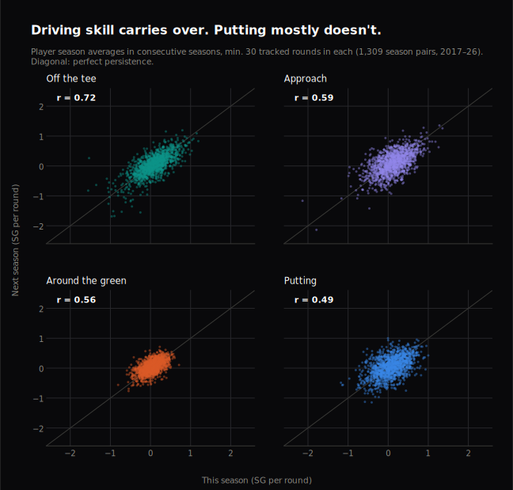
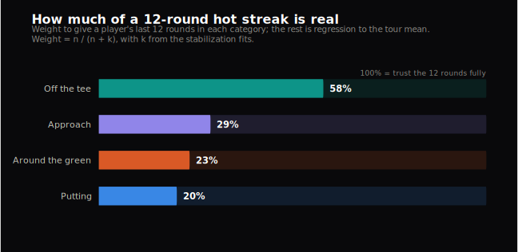

# How many rounds until you can trust a strokes-gained number?

*Josh Silverman · July 2026 · [Code and data pipeline on GitHub](https://github.com/josh-silverman/sg-reliability)*

A golfer gains two strokes a round on the field with his putter over three
tournaments and the broadcast says he's "found something." A course-fit model
leans on eight rounds of approach data. A bettor sees a month of elite
driving and prices it as skill. Which of those claims should you believe?

That's a question about **reliability**: how quickly a strokes-gained (SG)
average stops being mostly luck and starts being mostly skill. Baseball
answered it years ago — sabermetrics knows almost exactly how many plate
appearances each stat needs before it "stabilizes." Golf folklore has an
answer too: approach play is the real skill, putting is noise. I wanted the
actual numbers, per category, with uncertainty attached.

**The headline: the folklore is half right.** Putting is indeed the noisiest
thing on tour — a putting average needs ~48 rounds to become even half
signal. But the most reliable category isn't approach. It's driving, and
it's not close: strokes gained off the tee is half signal in **~9 rounds**,
five times faster than putting.

## Why it matters

Every practical use of SG data is secretly a bet on these numbers:

- **Prediction and betting.** If you weight a hot month of putting like a
  hot month of driving, you're paying for noise.
- **"Who's in form."** Form talk is sample-size talk. Twelve rounds of
  elite driving is mostly real; twelve rounds of elite putting is mostly a
  coin flip.
- **Player evaluation.** A tour card, a Ryder Cup pick, a sponsor exemption
  — all routinely argued from samples this analysis says are too small for
  some categories and plenty for others.

## The data

Round-level strokes gained in four categories — off the tee (OTT), approach
(APP), around the green (ARG), putting (PUTT) — from the
[DataGolf](https://datagolf.com) historical raw data API: every PGA Tour
event with SG tracking from 2017 through mid-2026. That's 347 events and
134,951 player-rounds; 96 events (mostly opposite-field and fall events)
have no shot tracking and are excluded by construction.

Cleaning was minimal and decided before the analysis ran: drop the 1.29% of
rounds missing SG (satellite courses at multi-course events, where only the
host course is tracked), drop the Zurich Classic (a two-man team event), and
compute total SG as the sum of the four categories rather than trusting the
provided total (which has small constant per-round baseline offsets in a
handful of events). Final analysis set: **131,847 rounds by 1,772 players**.

One habit from my reliability-engineering work that I kept here: the full
analysis plan — questions, methods, thresholds, seeds, and what gets
reported regardless of outcome — was written and committed **before any
result was computed** ([`ANALYSIS_PLAN.md`](https://github.com/josh-silverman/sg-reliability/blob/main/ANALYSIS_PLAN.md)
in the repo). What follows is that plan, executed. Everything below is
reproducible from the repo with one command.

## Methods, in plain English

**Split-half reliability.** Take a player's rounds within a two-year
window. Deal them randomly into two piles of *n* and average each pile. If
an *n*-round average measures skill, a player's two piles should agree —
across all players, the two piles should correlate. That correlation *is*
the reliability R of an n-round average: the share of the variance in
players' n-round averages that reflects true skill differences rather than
sampling luck. I computed it for n from 5 to 60 (200 random deals each,
averaged), across five two-year windows, 2017–2026.

**Stabilization curves.** Reliability follows a known one-parameter curve,
R(n) = n / (n + k) — the same Spearman-Brown form sabermetrics uses. The
constant k is the whole story: it's the number of rounds at which a
category's average becomes exactly half signal, half noise. I fit k per
category and bootstrap the players (1,000 resamples) for confidence
intervals.

**Two checks that don't depend on the model:** year-over-year correlation
of season averages (≥30 tracked rounds in both seasons), and how well each
category's season average predicts *next* season's total SG.

## Results

### Stabilization: driving in 9 rounds, putting in 48

Rounds until a category's average is half signal (R = 0.5, the fitted k)
and mostly signal (R = 0.7), with bootstrap 95% CIs:

| Category | Half signal (R = 0.5) | Mostly signal (R = 0.7) |
|---|---|---|
| Off the tee | **8.7** [7.9, 9.7] | 20 [19, 22] |
| Total SG | 23 [20, 27] | 54 [47, 63] |
| Approach | 30 [26, 34] | 69 [60, 80]* |
| Around the green | 39 [36, 44] | 92 [83, 103]* |
| Putting | **48** [42, 54] | 111 [98, 125]* |

\* beyond the measured n = 60 grid — read these as fitted extrapolations.

Two tournaments of driving data tell you more about a player's tee game
than an entire season of putting data tells you about his putting. A full
PGA Tour season is roughly 70–90 tracked rounds for a regular; putting
never reaches R = 0.7 within one season. Approach is a genuinely strong
skill signal — the folklore isn't wrong about that — it just takes three
times the sample driving needs.

### The model-free check agrees

Correlating consecutive season averages (1,309 player-season pairs) needs
no fitted curve, and produces the same ordering: OTT **0.72**, APP 0.59,
ARG 0.56, PUTT 0.49. Rank (Spearman) correlations agree. Half of what looks
like putting skill in a full season doesn't survive to the next one.

### What to do with a hot streak

Reliability has a direct practical translation: R is the weight a sample
deserves, with the rest regressed to the tour mean. A player 12 rounds into
a hot streak keeps **58%** of a driving surge, 29% of approach, 23% of
around-the-green — and **20%** of putting. When a broadcaster says someone
"putts like a top-5 putter over the last three events," the sober estimate
keeps a fifth of it.

The forward-looking version: predicting next season's *total* SG from this
season's categories, driving is the best single predictor (r = 0.43),
approach close behind (0.40), putting far last (0.16). In a joint
regression, putting recovers some value (standardized β = 0.26 vs its 0.16
univariate r) — putting skill does exist and does matter; a season of it
just measures that skill badly.

### Who's asking changes the answer

One result I didn't pre-register but have to report. The primary curves use
every player with enough rounds at each sample size, so small-n estimates
include the full range of tour talent, while large-n estimates skew toward
regulars. Re-running the entire analysis on a fixed pool — only the 386
player-windows with 120+ rounds — reliability drops everywhere: k rises to
~14 for driving and ~43–48 for the other three, and approach's edge over
putting nearly disappears. The ordering (driving fastest, putting slowest)
survives, but the practical lesson sharpens: **among established tour
regulars, almost everything but driving is noise at small samples.**
"How many rounds until it's signal?" always depends on *signal about whom* —
separating a tour regular from the field is easier than separating tour
regulars from each other.

## What this means in practice

- **Trust early driving numbers.** ~9 rounds of SG:OTT is real information.
  It's also the most persistent skill and the best single predictor of
  future total SG.
- **Regress putting ruthlessly.** Keep ~20% of a 12-round putting streak.
  Putting narratives built on a few events are, quantitatively, ~80% story.
- **"Form" has a category structure.** The same three-event stretch is
  ~majority signal for driving and ~three-quarters noise for putting. Form
  claims that don't name a category aren't claims.
- **Season-long total SG is trustworthy at ~a half season** (R = 0.5 at
  ~23 rounds) — the aggregate stabilizes faster than three of its four
  parts because more shots contribute to it every round.

## Limitations

SG exists only at shot-tracked events, so fall/opposite-field golf is
invisible here. The two-year windows assume skill is stable within them —
real skill change gets counted as noise, so these k values are, if
anything, slightly pessimistic. R = 0.7 crossings for approach, around the
green, and putting extrapolate beyond the measured grid (the fitted form is
excellent within it). Reliability is population-relative (see above), and
2020 is a disrupted, shorter season. Course-fit and field-strength effects
are averaged over, not modeled.

## Appendix: formulas and reproducibility

Split-half reliability at n: r = corr(x̄₁, x̄₂) across players, where x̄₁, x̄₂
are means of disjoint random n-round halves; reported R(n) averages 200
splits. Stabilization: least-squares fit of R(n) = n/(n+k) over
n ∈ {5,…,60}; k is the R = 0.5 crossing and 7k/3 the R = 0.7 crossing. CIs:
percentile bootstrap, 1,000 resamples of player-windows, seed 42. Shrinkage
weight for an n-round sample: n/(n+k). Everything regenerates with
`python scripts/fetch_data.py && python scripts/run_analysis.py &&
python scripts/make_figures.py`; the analysis module has a test suite
validated against synthetic data with known reliability.

*Data from the DataGolf API, used per their terms (the pipeline is public;
the raw data is not redistributed).*
